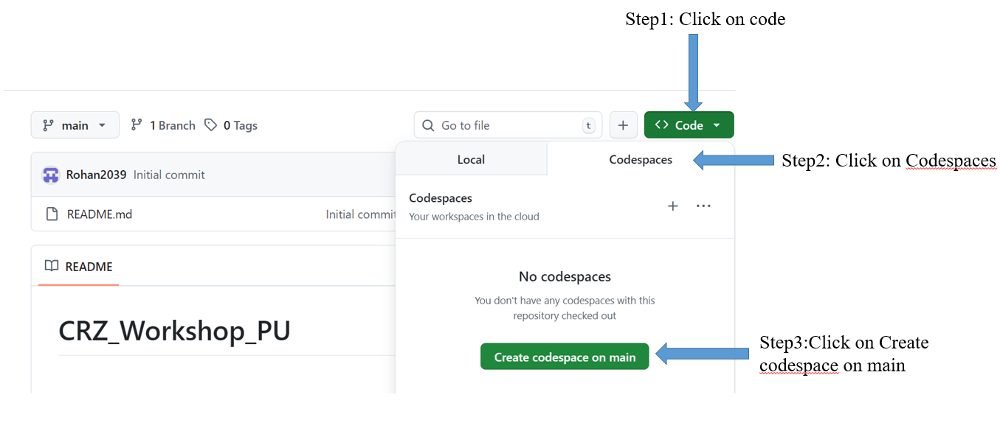
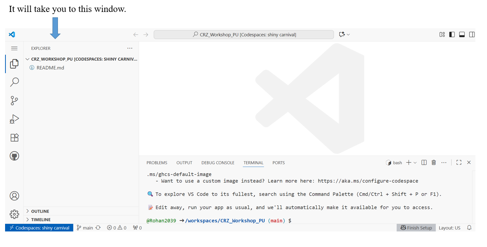
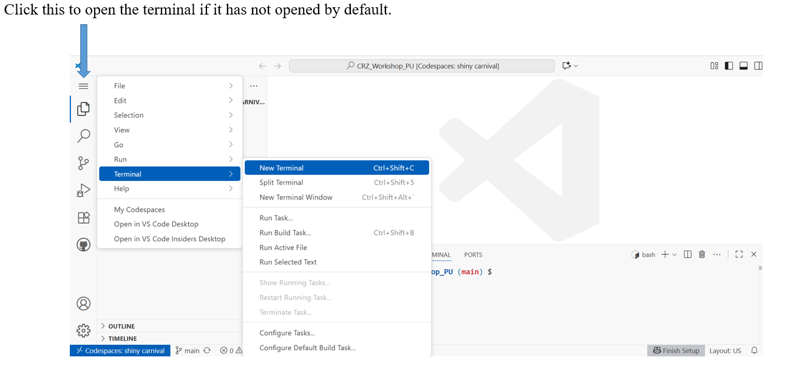
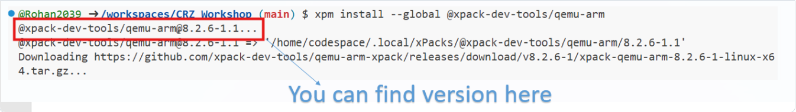
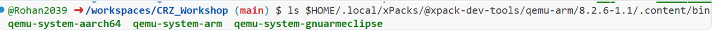
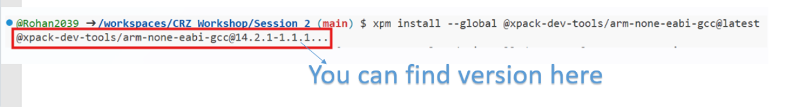
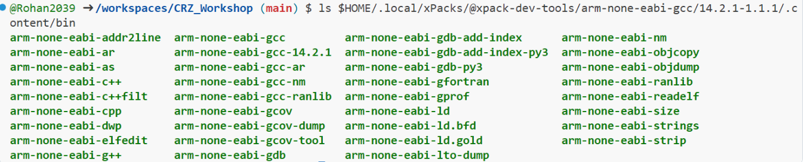

# ⚡ Gear up! 🚀 Follow these steps 📝 to get workshop-ready 🎯

## 1. Create a GitHub account.

[Click here to create a GitHub account](https://github.com/signup)

**Note:** If you already have an account, you can skip this step.

## 2. Open the CRZ_WORKSHOP_PU repository.

[Click here to open the repository](https://github.com/UNOFFICIALOFFICE/CRZ__WorkShop.git)

## 3. Create a new codespace.

### 3.1 Please follow the steps below to create a codespace.

 

---

 

---

 

## 4. Install gcc and QEMU tools.

    sudo apt update
    sudo apt-get install npm
    sudo npm install --global xpm@latest
    xpm install --global @xpack-dev-tools/qemu-arm@8.2.6-1.1
    xpm install --global @xpack-dev-tools/arm-none-eabi-gcc@14.2.1-1.1.1

## 5. Verify the installation.

### 5.1 QEMU Tools.(Hardware emulator)

    ls $HOME/.local/xPacks/@xpack-dev-tools/qemu-arm/<version>/.content/bin

- Note: Fill in the **version** field with the appropriate version.

   

   **Out Put**

   

### 5.2 GCC Tools (Compiler suite (compiles, links, debug))

    ls $HOME/.local/xPacks/@xpack-dev-tools/arm-none-eabi-gcc/<version>/.content/bin

- Note: Fill in the **version** field with the appropriate version.

   

   **Out Put**

   

## Set Path Variables.

    export PATH="$PATH:$HOME/.local/xPacks/@xpack-dev-tools/qemu-arm/8.2.6-1.1/.content/bin"
    export PATH="$PATH:$HOME/.local/xPacks/@xpack-dev-tools/arm-none-eabi-gcc/14.2.1-1.1.1/.content/bin"
