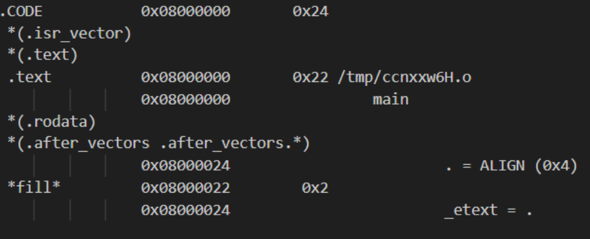
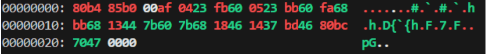
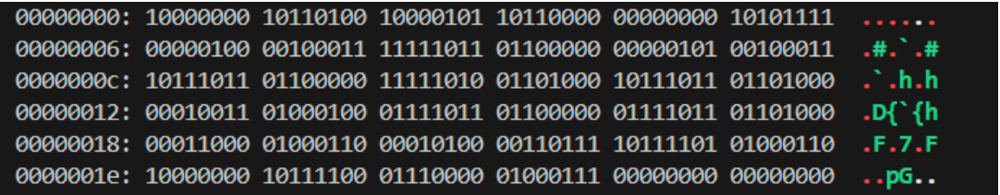
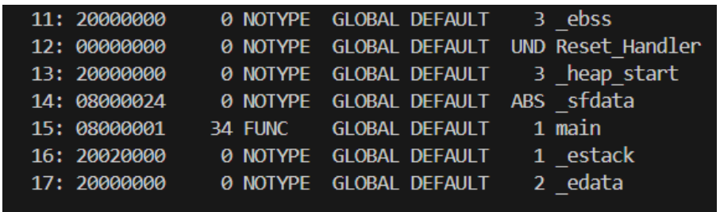
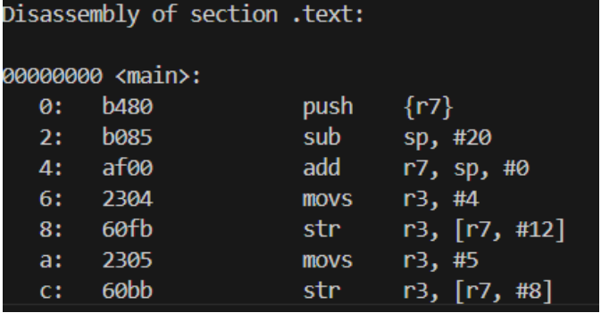

# **Workshop - Session 1**

# *Steps to see the Binaries*

## main.c --->Compiler ---> main.s

   arm-none-eabi-gcc -S -O0 -mcpu=cortex-m3 -mthumb main.c -o main.s
- C language will be converted to Assembly code.

## main.s ---> Assembler ---> main.o

   arm-none-eabi-as -mcpu=cortex-m3 -o main.o main.s
- Converts assembly instructions → machine code (Binaries with some holes which will be filled by linker.)

## main.o ---> Linker ---> main.elf

    arm-none-eabi-ld -T Linker.ld  main.o -o main.elf
 - Combines object files, resolves symbols, applies linker script
 - Output: main.elf (executable, with memory layout, symbols, debug info)

 ## main.elf ---> Objcopy ---> main.bin

    arm-none-eabi-objcopy -O binary main.elf main.bin
 - Converts ELF → raw flashable binary(only 0s and 1s)

 ## main.o ---> -Map ---> main.map

    arm-none-eabi-ld -T Linker.ld main.o -Map=main.map
 - -Map=main.map → generates memory map showing section addresses, symbol addresses, sizes

 # How to read bin and elf files

 ## .bin files

    hexdump -C main.bin

    xxd -C main.bin --> colourful display

 

    xxd -b main.bin --> only binaries(0s and 1s)

 

 ## .elf files

    arm-none-eabi-readelf -a main.elf

 -you can write **arm-none-eabi-readelf main.elf** to explore more option as -flags

***Portion of elf file showing symbol table***

 

 ## For Nice representaion of binary and Instruction set

    arm-none-eabi-objdump -d main.o

 

 To explore -flags : **arm-none-eabi-readelf main.elf**

--- 
---

[Link to 16-bit Thumb instruction encoding ](https://developer.arm.com/documentation/ddi0403/d/Application-Level-Architecture/The-Thumb-Instruction-Set-Encoding/16-bit-Thumb-instruction-encoding?lang=en)